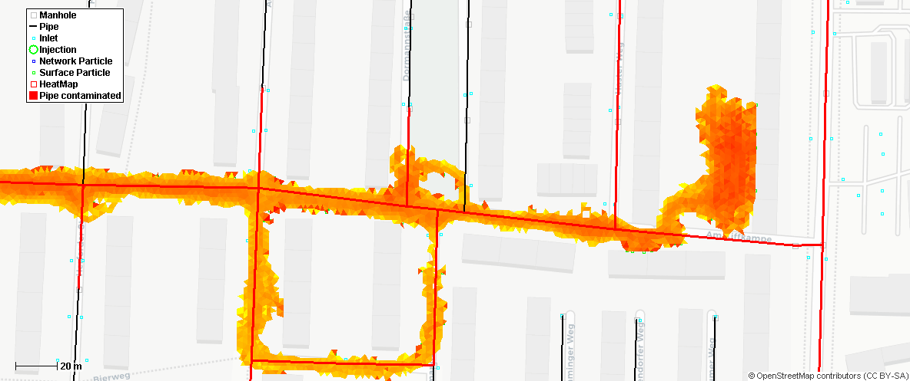
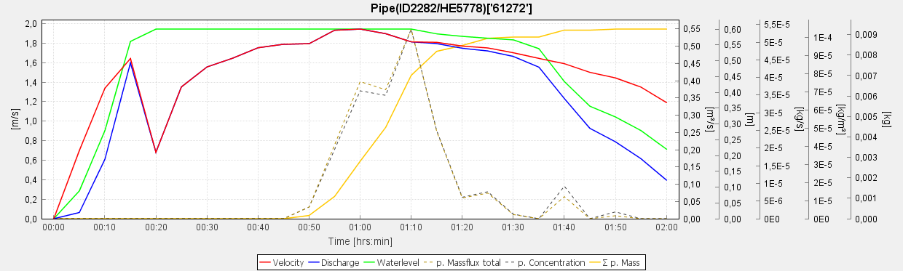

# GULLI
GULLI Urban pollution transport model 

Lagrangean particle based transport model to track point source injected solutes in case of urban flood events. Coupling of different domains (Surface 2D, Pipes 1D and Soil 3D) to model the spreading of solute in the drainage water (advective & diffusion/dispersion).

Input:  
   + Dynamic or stationary flow fields for pipe system, surface and/or soil. e.g. SWMM or HYSTEM EXTRAN  
   +Spill location+time.
   
Output:   
   + concentration breakthrough curves in pipes  
   + contamination shapes on the surface  
   + contamination shapes in the soil
        

        
This transport model is a product of the research project "Real-Time Prediction of Pluvial Floods and Induced Water Contamination in Urban Areas (EVUS)" (https://www.pluvialfloods.uni-hannover.de/pluvialfloods.html).
Goal of the transport model is providing very fast forecast of contamination areas in case that a spill event was reported. Therefore the focus lies on computational speed.

For more information, please contact Robert Sämann (https://www.hydromech.uni-hannover.de/de/ueber-uns/personenverzeichnis/)
