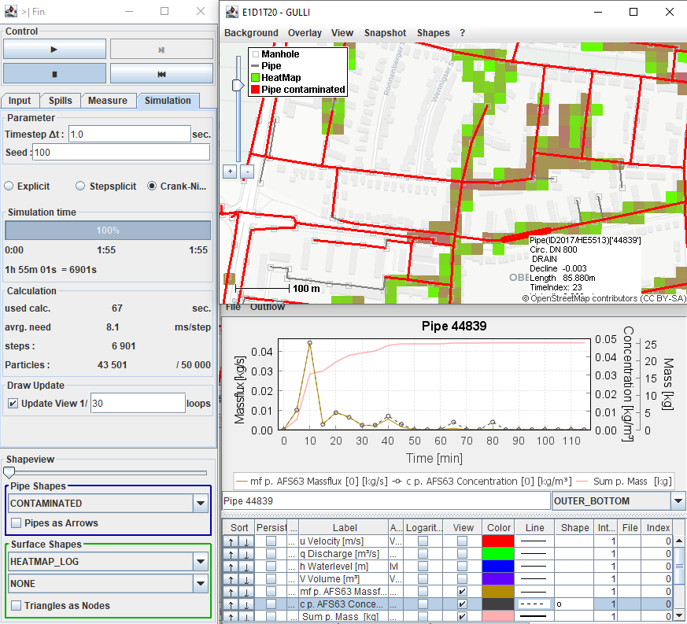

## GULLI Urban pollution transport model 

Lagrangean particle based transport model to track point source injected solutes in case of urban flood events. Coupling of different domains (Surface 2D, Pipes 1D and Soil 3D) to model the spreading of solute in the drainage water (advective & diffusion/dispersion).

Input:  
   + Dynamic or stationary flow fields for pipe system and surface e.g. SWMM or HYSTEM EXTRAN  
   + Spill location & time.
   
Output:   
   + Concentration breakthrough curves in pipes  
   + Contamination shapes on the surface  
   + Mass intensity and dynamic loads of pollutants
   + Traces of pollutants from their journey through pipe and surface flow
        

        
---------------
## Research project

This transport model is a product of the research project "Real-Time Prediction of Pluvial Floods and Induced Water Contamination in Urban Areas (EVUS)" (https://www.pluvialfloods.uni-hannover.de/pluvialfloods.html).
Goal of the transport model is providing very fast forecast of contamination areas in case that a spill event was reported. Therefore the focus lies on computational speed.

See, what it is designed for: Fast prediction of contaminant transport to warn residents and inform firefighters to embank before the actual spread.

---------------
## Installation

This repository is designed for working with Maven in the Java IDE NetBeans

[Guide for installation with Netbeans Maven](readme/installation/MavenInstall.md)

Alternatively, for a quick insight, you can download the [pre-release demonstrator](https://github.com/rsaemann/GULLI/releases/tag/Demo) ([Jar File](https://github.com/rsaemann/GULLI/releases/download/Demo/GULLI-view-1.0-SNAPSHOT-shaded.jar) )

Both will show up the graphical user interface where you can run simulations with the provided Scenarios.

------
## Scientific reference

Please cite

    Sämann, Robert & Graf, Thomas & Neuweiler, Insa. (2018).
    Modeling of contaminant transport during an urban pluvial flood event – The importance of surface flow.
    Journal of Hydrology. 568. 
    10.1016/j.jhydrol.2018.10.002
    
[10.1016/j.jhydrol.2018.10.002](https://doi.org/10.1016/j.jhydrol.2018.10.002) 

Find it on [Researchgate](https://www.researchgate.net/publication/328486209_Modeling_of_contaminant_transport_during_an_urban_pluvial_flood_event_-_The_importance_of_surface_flow).

For more information, please contact Robert Sämann (https://www.hydromech.uni-hannover.de/saemann/)

You can also find me on Researchgate (https://www.researchgate.net/profile/Robert_Saemann)
