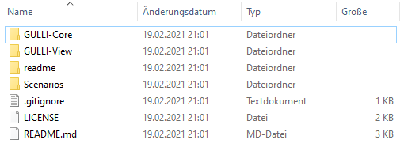
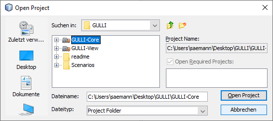
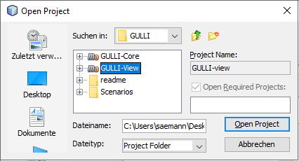
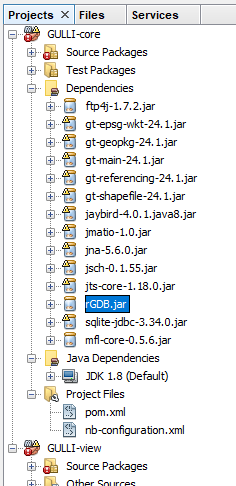
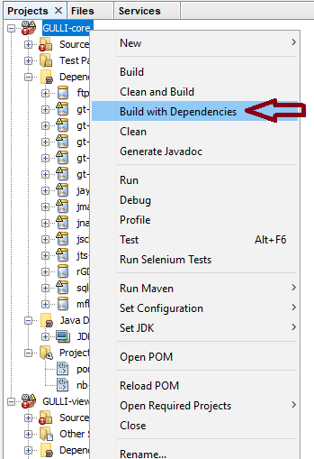
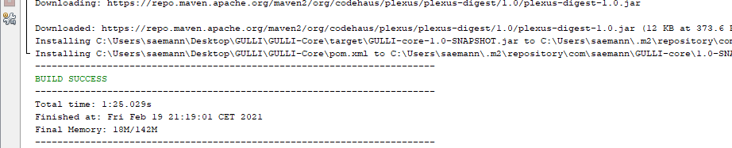
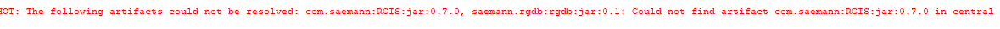
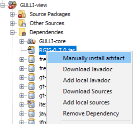
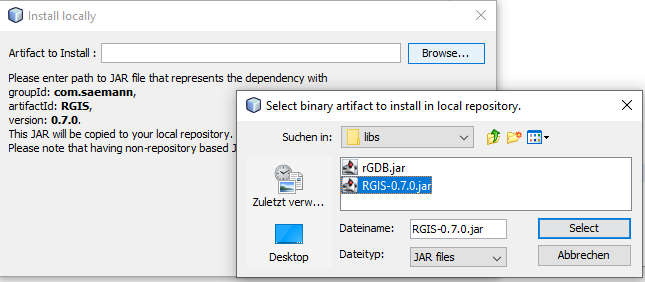
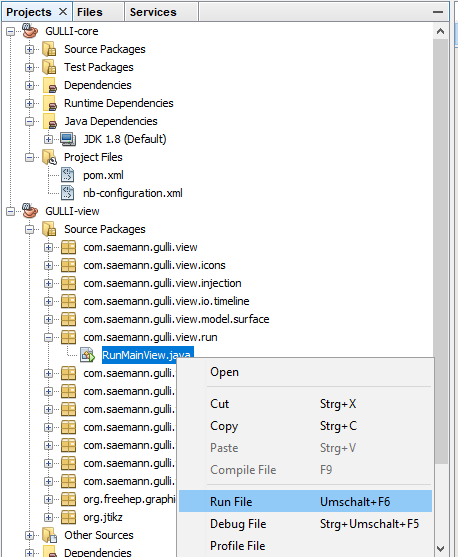

## Install for Maven in Netbeans 8

Two subfolders contain the modules for GULLI:
  + GULLI-core 
  + GULLI-view
  
GULLI core contains all the logic to run the simulation and produce outputs in form of files. Inputs, outputs and simulation parameters have to be defined via code.
GULLI view contains all graphical user interface files and has the ability to define most inputs, outputs and simulation parameters via the user interface.

------

Clone this repository by downloading and unzipping the content of the repository into to file system of your computer.

-----
Start NetBeans (8.2)

Select File Menu -> Open Project... and navigate to the directory, where you downloaded the repository.

First, select the GULLI-core project and click OK

Secondly add the GULLI-view project as described before.

------
Now, the source code is accessible to you in the **SourcePackage** folders of the project.
But the project can not be run, because required libraries are not yet on your computer. Several errors and exclamation marks will occur.

This is, where Maven comes into play. I have only defined where to find and download the required libraries and Maven will do this for you.
Names and lookup servers are defined in the **pom.xml** file.
To start the automatic download process, right-click on the project and select "Build with dependencies". You need internet connection for this step.

After some time, the build is completed and a success-message shows up in the console. The warnings in the project panel vanish.
Run the "Build with dependencies" action first on the GULLI-core, then on the BULLI-view project.

-------
# Error handling
It might occur, that libraries cannot be found. This will show up a red-font message "Artifact not found".

Some of the libraries cannot be found in the internet, because they are build by myself. I delivered the library jar files in the "lib" folder of the project.

For example, if **RGIS** was not found on the internet, you have to install it locally.

Search for the missing library in the dependency-folder of the project panel. Right-click on it and select "Install manually...".

Navigate to the lib folder in the project and select the jar with the most equal name.

Proceed for every missing dependency. If the dependency was not created and delivered from my side you might have to look up in the internet for a similar jar file. Be careful who to trust, install and use from unofficial sides! 

-------
# Run the software

If both builds have successfully run and no warnings are displayed, you can start the software.

In the GULLI-view Project, go to SOurcePackages -> com.saemann.gulli.view.run -> RunMainView.java and select "Run File"

The RunMainView is the standard file, that opens up the user interface.

